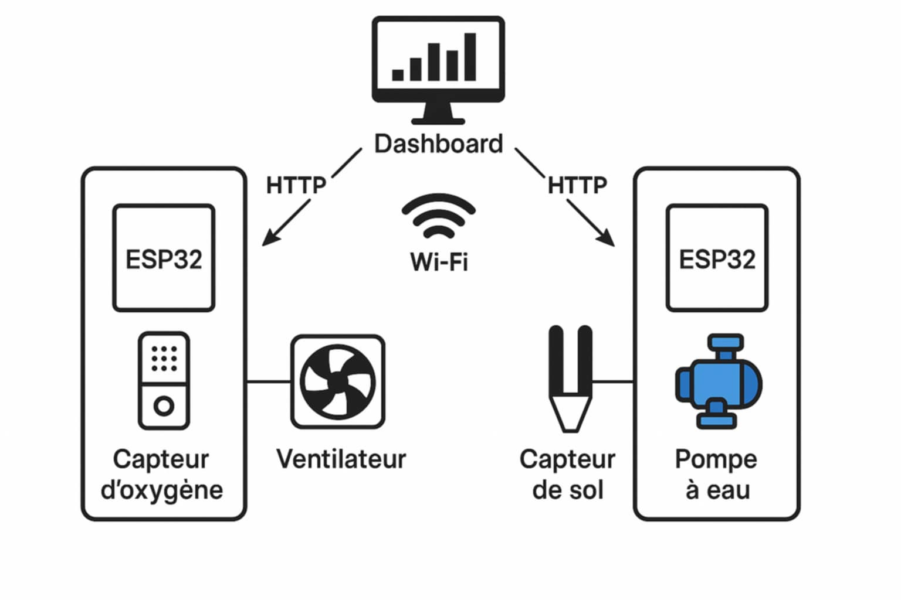

# Smart Farm – Système de Surveillance Intelligent

## Description du projet

Ce projet de **ferme intelligente (Smart Farm)** combine des systèmes embarqués, de l’intelligence artificielle et une application web pour assurer la surveillance environnementale et la détection d’incendie en temps réel.
Il repose sur des cartes **ESP32**, des capteurs (température, humidité, sol), un modèle de vision par ordinateur pour la détection de feu et un **dashboard Streamlit** pour la visualisation des données.

Le système permet :

* La détection automatique d’un incendie via une caméra et un modèle YOLOv5
* L’envoi d’alertes vers un ESP32 (buzzer)
* La centralisation des alertes dans un serveur FastAPI
* L’affichage des données ESP32 et des prévisions météo sur une interface web

---

## Architecture générale

1. Caméra + IA (YOLOv5)
   Analyse en temps réel du flux vidéo pour détecter la présence de feu.

2. ESP32

   * Lecture des capteurs (température, humidité, sol)
   * Activation d’un buzzer en cas d’incendie
   * Envoi des données vers le serveur

3. Serveur FastAPI

   * Réception des alertes
   * Stockage des données dans un fichier JSON

4. Dashboard Streamlit

   * Visualisation des données ESP32
   * Affichage des alertes incendie
   * Consultation de la météo et des prévisions via l’API OpenWeatherMap

---

## Structure du projet

```
smart-farm/
│   esp_data.json
│   fire_detection.py
│   fire_detection_model.pt
│   receiver.py
│   requirements.txt
│   streamlit_app.py
│   README.md
│
├── esp32-fire-buzzer/
│   └── esp32-fire-buzzer.ino
│
├── ESP32-sol-dht11-dashboard/
│   └── ESP32-sol-dht11-dashboard.ino
│
├── images/
│   ├── ia-model-dashboard.jpg
│   └── shema-ventilateur-pompe.jpg
│
└── templates/
    └── index.html
```

---

## Illustrations du projet

### Architecture de projet

Cette image montre l'architecture de projet.


### Schéma de commande des actionneurs

Schéma illustrant le contrôle du ventilateur et de la pompe dans le système de la ferme intelligente.



---

## Description des fichiers principaux

### fire_detection.py

Script Python utilisant YOLOv5 pour détecter le feu via une webcam.

* Chargement d’un modèle entraîné
* Inférence en temps réel
* Envoi d’une alerte HTTP à l’ESP32
* Transmission de l’alerte au serveur FastAPI

### receiver.py

Serveur FastAPI chargé de :

* Recevoir les alertes incendie
* Ajouter un horodatage
* Sauvegarder les données dans `esp_data.json`

### streamlit_app.py

Application Streamlit servant de tableau de bord :

* Affichage météo et prévisions
* Carte interactive avec Folium
* Visualisation des alertes et données ESP32
* Rafraîchissement automatique des données

### esp32-fire-buzzer.ino

Programme ESP32 permettant :

* La réception d’une alerte HTTP
* L’activation d’un buzzer en cas d’incendie

### ESP32-sol-dht11-dashboard.ino

Programme ESP32 pour :

* Lire la température et l’humidité (DHT11)
* Lire l’humidité du sol
* Envoyer les données vers le système central

---

## Installation et exécution

### Prérequis

* Python 3.8 ou plus
* ESP32 avec Arduino IDE
* Webcam
* Connexion Internet pour l’API météo

### Installation des dépendances

```bash
pip install -r requirements.txt
```

### Lancer le serveur FastAPI

```bash
uvicorn receiver:app --host 0.0.0.0 --port 80
```

### Lancer la détection d’incendie

```bash
python fire_detection.py
```

### Lancer le dashboard Streamlit

```bash
streamlit run streamlit_app.py
```

---

## Technologies utilisées

* Python
* YOLOv5 (PyTorch)
* OpenCV
* FastAPI
* Streamlit
* ESP32
* OpenWeatherMap API
* HTML / JavaScript

---

## Objectif du projet

Ce projet vise à démontrer l’intégration de l’intelligence artificielle, des systèmes embarqués et des applications web pour la surveillance et la sécurité dans le domaine agricole.
Il est destiné à un usage académique et expérimental dans le cadre des systèmes IoT et des fermes intelligentes.